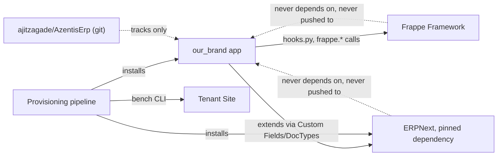
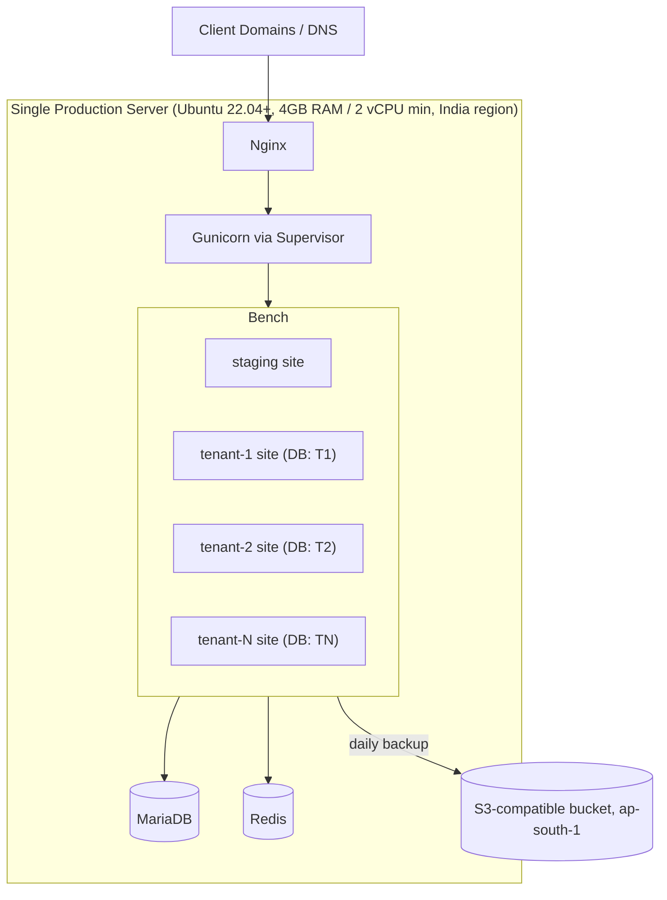
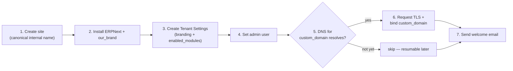
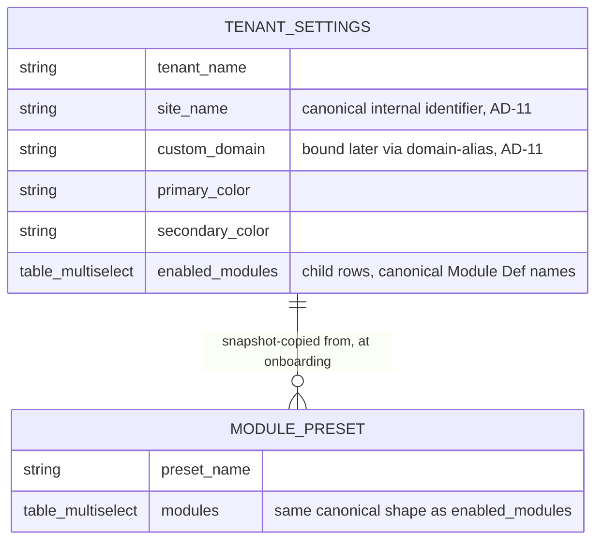

# Architecture Spine — AzentisERP

## Design Paradigm

Two structurally distinct concerns, each following its own well-known pattern:

- **Frappe Hook/Plugin Extension** — the runtime/app layer (branding, Tenant Settings, module toggling) is a single Frappe app (`our_brand`, a working name pending final brand decision — see Deferred) that extends Frappe/ERPNext purely through its own supported extension points: `hooks.py`, DocTypes, Custom Fields, page-load hooks, template overrides. It never modifies Frappe/ERPNext source.
- **Idempotent CLI Pipeline** — the provisioning/orchestration layer (client onboarding) is a sequence of independently-checkable, resumable steps invoked as a `bench` custom command, not a request-cycle concern and not a hosted service.

Layer → namespace mapping:

| Layer | Namespace |
| --- | --- |
| Runtime extension | `our_brand/our_brand/doctype/*`, `our_brand/hooks.py`, `our_brand/public/*`, `our_brand/templates/*` |
| Provisioning pipeline | `our_brand/commands/*` (bench custom commands) |

## Invariants & Rules

### AD-1 — Customization lives only in the Branding App; ERPNext/Frappe are pinned dependencies, never forked or pushed to

- **Binds:** all FRs (platform-wide)
- **Prevents:** a direct edit to Frappe/ERPNext source for a "quick fix," breaking upstream mergeability (FR-15, FR-16); also prevents treating a forked copy as a repo we own/push to, which was the original plan but is now explicitly rejected
- **Rule:** All product behavior (branding, Tenant Settings, module toggling, provisioning) lives in the Branding App (`our_brand`) and the Custom Field/Custom DocType layer. Dependency direction is one-way: `our_brand` → Frappe/ERPNext APIs. Frappe/ERPNext core is never modified and never imports from `our_brand`. **Neither Frappe Framework nor ERPNext is forked.** Both are pulled directly from their official upstream repos (`frappe/frappe`, `frappe/erpnext`), pinned to `version-15` (a specific branch/commit, not "whatever upstream currently has"), and are treated as read-only dependencies — never modified, never pushed to. `apps/frappe` and `apps/erpnext` inside the Bench are gitignored in our own repo (`ajitzagade/AzentisErp`), the same way a `node_modules`-style dependency would be. Only `our_brand` — our actual product code — is version-controlled and pushed, to `ajitzagade/AzentisErp`. Staged updates (FR-16, AD-9's staging site) mean re-pinning to a newer upstream commit/tag and testing it on staging first, not merging a fork.



### AD-2 — Tenant Settings is the single source of branding/module truth per site

- **Binds:** FR-7, FR-8, FR-9, FR-10
- **Prevents:** branding/module state duplicated across CSS files, `site_config.json`, and DocType records with no clear owner, causing drift (a color changed in one place, not reflected in another)
- **Rule:** One Tenant Settings DocType (Single, one record per site) holds all tenant branding fields and `enabled_modules` (Table MultiSelect field, rows referencing canonical Module Def names — see Consistency Conventions). Every read path *of Tenant Settings itself* goes through one accessor function using `frappe.get_cached_doc("Tenant Settings")` — never a scattered raw `frappe.get_single`/`frappe.get_doc` call at each call site. Frappe invalidates this cache automatically on save, so the single accessor is never stale — this is the same mechanism AD-3 relies on for live updates, not a competing one. **Sidebar filtering (Epic 3, Story 3.2) is the one deliberate exception**: rather than reading Tenant Settings on every desk-sidebar request, `enabled_modules` is synced into Frappe's own `User.block_modules` field at Tenant Settings save time (`our_brand.module_rules.sync_blocked_modules`, a `Tenant Settings` `on_update` hook), and the sidebar reads that already-synced per-user field via Frappe's own existing `get_workspace_sidebar_items()` — avoiding a Tenant Settings fetch on every desk page load. This still has exactly one seam (the sync function), just not the same accessor branding injection uses; `apply_preset()`'s own read of Tenant Settings uses a plain `frappe.get_doc` rather than the cached accessor since it's a write path about to mutate and save the document, not a read path this rule governs.

### AD-3 — Branding injection is live/dynamic, never asset-pipeline-compiled

- **Binds:** FR-8
- **Prevents:** a per-tenant static CSS file requiring `bench build`/restart to reflect a change, which violates FR-8's "no bench restart" requirement
- **Rule:** Tenant colors/branding render as inline CSS custom properties, injected via a page-load hook that reads Tenant Settings through the AD-2 accessor on every request. No per-tenant compiled asset file is ever generated. Because the AD-2 accessor's cache is invalidated on save, "reads on every request" and "cached" are the same behavior, not a contradiction — no manual cache-busting logic is needed.

### AD-4 — Module toggling is navigation-level, not a security boundary, at MVP

- **Binds:** FR-9, FR-10
- **Prevents:** one build path enforcing `enabled_modules` as a hard permission boundary (blocking direct DocType/API access) while another treats it as cosmetic sidebar hiding — the two are incompatible and one is substantially more work; must be fixed once, not discovered mid-build
- **Rule:** `enabled_modules` controls Workspace/sidebar visibility only, via a hook filtering the desk sidebar/workspace list. It does not alter Role Permissions and does not block direct DocType/API access. Acceptable because every user within one tenant is that tenant's own trusted staff — no adversarial internal-user model at MVP. `[ASSUMPTION: revisit if a tenant ever needs internal trust tiers — see Deferred.]`

### AD-5 — Module presets are data, not code

- **Binds:** FR-10
- **Prevents:** presets hardcoded as a Python dict/if-else in hook logic, requiring a code change to add a fifth preset — directly violates the PRD's Flexibility NFR
- **Rule:** Module Preset is its own DocType (name + ordered module list). Applying a preset at onboarding copies its module list into the new Tenant Settings record as a snapshot — not a live foreign key. Adding a preset is a data operation (new DocType record), never a code change.

### AD-6 — Module dependency checks are warn-only, enforced at one seam

- **Binds:** FR-10, SM-C2 (PRD §10.6: warn-only, not hard-block)
- **Prevents:** dependency-checking logic duplicated or reinvented at each call site (preset application, manual toggle) with inconsistent behavior between them
- **Rule:** One dependency map (data: `{module: [required_modules]}`, keyed by the same canonical Module Def names as `enabled_modules` — see Consistency Conventions) and exactly one validation function, `our_brand.module_rules.validate_dependencies()`, are the only path deciding warn conditions. Both the preset-apply flow and the manual Tenant Settings toggle import and call this same function by that path — no separate ad hoc checks, no re-implementation.

### AD-7 — Provisioning is one idempotent, resumable pipeline

- **Binds:** FR-6, FR-11
- **Prevents:** a partial failure mid-provisioning (site created, app install fails) leaving an inconsistent site with no defined recovery path, forcing manual cleanup every time it happens
- **Rule:** The provisioning pipeline is a sequence of steps that each check current state before acting: site created under its canonical internal name (see AD-11 for domain identity) → apps installed → Tenant Settings created → admin set → TLS requested (AD-11) → welcome email sent. Re-running the pipeline after a partial failure always resumes safely rather than erroring or duplicating work.

### AD-8 — Provisioning runs on the production server; no remote orchestration API at MVP

- **Binds:** FR-6, FR-11
- **Prevents:** building a remote-triggerable onboarding API/service — a whole extra surface (auth, network exposure, versioning) — before real volume or a non-technical operator justifies it
- **Rule:** Onboarding automation is a `bench` custom command invoked directly on the production server (operator SSHs in and runs it). Not a hosted API endpoint at MVP.

### AD-9 — Staging is a site on the same production bench, not a separate server

- **Binds:** FR-16
- **Prevents:** assuming a second physical server is available for staging, which the MVP budget (single 4GB RAM / 2 vCPU box) doesn't provide — silently blocking the staged-rollout requirement if left undecided
- **Rule:** The staging site is one more site on the production bench, used exclusively to verify an upstream merge before `bench update` touches any tenant site.

### AD-10 — Offsite backups target Frappe's native S3-compatible mechanism, India region

- **Binds:** FR-13
- **Prevents:** the backup destination being decided ad hoc later (random script, unmounted drive), disconnected from Frappe's own well-documented path
- **Rule:** Offsite backups use Frappe's native S3-compatible backup mechanism (`s3_backup_enabled` + `s3_backup_region` in `site_config.json`, or the bundled `push_backup` path), targeting an S3-compatible bucket in the `ap-south-1` (Mumbai) region. The region is **our choice**, driven by the India data-residency decision (PRD §10.4) — Frappe's mechanism accepts any configured region and has no default of its own. `[ASSUMPTION: exact bucket/vendor not contracted — any S3-compatible provider with an Indian region satisfies this rule.]`

### AD-11 — TLS issuance is a pipeline step, not a separate manual task

- **Binds:** FR-12
- **Prevents:** TLS being left as an undocumented manual follow-up after onboarding — risking either the <10-minute SM-2 target or a tenant left on plain HTTP with no tracked completion state; also prevents conflating a tenant's *site identity* (internal, assigned at creation) with its *public custom domain* (added when DNS is ready), which would otherwise force one-shot "site name must equal final domain" provisioning incompatible with UJ-1's edge case
- **Rule:** Each tenant site is created under a canonical internal identifier (e.g. `{tenant-slug}.{platform-domain}`) as an AD-7 pipeline step. Requesting a TLS certificate (`bench setup lets-encrypt {site}`) and binding a client's `custom_domain` (Frappe domain-alias, `bench setup add-domain`) are separate, later, independently idempotent pipeline steps — each checks whether DNS for the target domain already resolves before acting, and is safely re-runnable once it does. This lets onboarding complete (and hit SM-2) even when a client's DNS isn't ready yet, exactly as UJ-1's edge case describes, while still tracking TLS/domain-binding as a defined, resumable step rather than an ad hoc follow-up.

### AD-12 — Desk-wide theming is CSS/JS injection targeting the existing DOM, never core source modification

*(Added 2026-07-12 via Sprint Change Proposal — see `sprint-change-proposal-2026-07-12.md`.)*

- **Binds:** FR-17
- **Prevents:** desk-UI theming ambition creeping into a Frappe/ERPNext fork (violates §5 Non-Goals and AD-1's pinned-unforked rule) on one hand, or into unbounded, undocumented runtime monkey-patching that Epic 5's upstream-update verification (AD-9/FR-15-16) can't reason about on the other
- **Rule:** All desk-wide visual theming ships as CSS (`app_include_css`) and JS (`app_include_js`) from `our_brand`, in the same style as Story 1.3's login-page theming — restyling Frappe's existing DOM/class structure, never editing a Frappe/ERPNext source file. This reaches colors, typography, spacing, iconography, and Frappe's *native* Workspace/dashboard-widget system (which is itself a data-driven customization surface, not core source). It explicitly does **not** reach structural redesign of Frappe's list/table/kanban/global-search view classes — those are hard-coded client-side JS, not a themeable surface, and reaching them would mean either forking core (ruled out) or extensive selector/behavior monkey-patching whose fragility against upstream updates has not been evaluated. Every new CSS/JS selector this work introduces must be recorded (file + selector + what Frappe DOM structure it depends on) so Story 5.4/5.5's staged-upstream-update verification has a concrete checklist to re-test against, not just "did the app still install" — the more DOM this app depends on, the more that verification now actually needs to check.

## Consistency Conventions

| Concern | Convention |
| --- | --- |
| Naming (entities, files, interfaces, events) | Site name = the tenant's **canonical internal identifier** (`{tenant-slug}.{platform-domain}`), assigned at provisioning — this is the Frappe DNS-multitenancy site key, not necessarily the client's final public domain. A client's `custom_domain` is bound afterward via Frappe's domain-alias mechanism (AD-11); the two are related but distinct, matching FR-7 and UJ-1. Branding App DocTypes/fields use standard Frappe snake_case. Module names referenced by their canonical ERPNext Module Def string, never a locally invented alias. App itself named `our_brand` (working name) pending final brand-name decision. |
| Data & formats | Tenant Settings is a **Single** DocType — one record per site, never a multi-row table keyed by tenant (tenant separation is already enforced at the DB level, not by a tenant-id column). `enabled_modules` is a **Table MultiSelect** field (child rows, each referencing a canonical Module Def name) — not a JSON/text list. Module Preset records store an ordered list of the same canonical module names, in the same shape. |
| State & cross-cutting | No cross-site DB connections from application/hook code, ever — any platform-wide view (e.g., "how many tenants do I have") is produced by iterating the bench's site list externally, never a live cross-database query from `our_brand` code. Hook failures (e.g., malformed Tenant Settings) fail open to stock/default branding rather than breaking page render for tenant users. |

## Stack

| Name | Version |
| --- | --- |
| Frappe Framework | `version-15` branch, stock (unforked) from `frappe/frappe` — verified requires Python 3.11+, Node 18+, MariaDB 10.3.x minimum |
| ERPNext | `version-15` branch, stock (unforked) from `frappe/erpnext`, pinned to a specific commit — never modified, never pushed to |
| Python | 3.11+ |
| Node.js | 20 LTS or 22 LTS for actual deployment (Frappe v15's stated floor is 18+, but Node 18 itself has been EOL since April 2025 — do not deploy on it) |
| MariaDB | 10.11+ (verified v15 floor is 10.3.x; 10.6 reached EOL July 2026, so 10.11 — the current LTS — is the deploy floor, not just a "safer" choice) |
| Redis | latest stable compatible with Frappe v15 (cache + queue) |
| Web/process | Nginx + Gunicorn, managed by Supervisor (`bench setup production` defaults) |
| Backup target | S3-compatible bucket, `ap-south-1` (Mumbai) — our choice per India data-residency (AD-10), not a Frappe default |
| OS | Ubuntu 22.04+ |

`[ASSUMPTION: staying on version-15 rather than the newer version-16 (GA as of 2026, not itself immature — but it requires a combined Python 3.14 + Node 24 + framework jump). v15 remains Frappe's own currently-recommended stable branch; avoiding a triple version jump reduces risk for a solo, 1-month build. Revisit v16 once the immediate MVP is stable — see Deferred.]`

## Structural Seed

### Deployment & environments



### Source tree (Branding App)

```text
our_brand/
  hooks.py                        # app metadata, app_include_css, page/session hooks
  our_brand/
    doctype/
      tenant_settings/             # Single DocType: branding + enabled_modules
      module_preset/                # DocType: named module bundles (AD-5)
    www/
      login/                       # login page override
    templates/
      emails/                      # branded transactional email templates
    public/
      css/custom.css                # platform-level static theming (AD-1/AD-3 boundary)
      images/                       # logo, favicon
  commands/
    provision.py                   # idempotent onboarding pipeline (AD-7, AD-8)
```

### Provisioning pipeline (AD-7, AD-11)


*Each numbered step checks its own completion state before acting (AD-7), so re-running the pipeline after a partial failure — or after DNS finally resolves — is always safe.*

### Core entities



## Capability → Architecture Map

| Capability / Area | Lives in | Governed by |
| --- | --- | --- |
| FR-1–FR-3 Brand identity & white-labelling | `our_brand/public`, `our_brand/templates`, `hooks.py` | AD-1, AD-3 |
| FR-4–FR-6 Multi-tenant site provisioning | Bench site layer + `our_brand/commands/provision.py` | AD-1, AD-7, AD-8, AD-9 |
| FR-7–FR-8 Per-tenant config & dynamic branding | `our_brand/doctype/tenant_settings` | AD-2, AD-3 |
| FR-9–FR-10 Module management & presets | `our_brand/doctype/module_preset`, sidebar-filter hook | AD-4, AD-5, AD-6 |
| FR-11 Client onboarding automation | `our_brand/commands/provision.py` | AD-7, AD-8 |
| FR-12 TLS per tenant domain | Pipeline step in `our_brand/commands/provision.py` | AD-7, AD-11 |
| FR-13 Automated offsite backups | Server-level (`site_config.json` S3 config, cron) | AD-10 |
| FR-14 Network access control | Server-level, one-time hardening (see Structural Seed deployment diagram) | not AD-governed — operational setup task, no divergence risk between independently-built units |
| FR-15–FR-16 Upstream update & maintainability | Repo/git structure (`our_brand` isolated app), staging site | AD-1, AD-9 |

## Deferred

- **Full RBAC-level module enforcement** (vs. AD-4's navigation-only toggling) — only if a tenant ever needs internal user trust tiers within their own instance.
- **Self-service or remote-triggered onboarding API** (vs. AD-8's SSH-run CLI) — v1.1+, once volume or a non-technical operator justifies the extra surface.
- **Multi-server / HA deployment topology** — v2, per PRD non-goal; single server covers the Year-1 10-20 tenant target.
- **Hard-block module dependency enforcement** (vs. AD-6's warn-only) — only if warn-only proves insufficient in practice.
- **Automated staged-upstream-update tooling** — first 1-2 merge cycles done manually to learn the real conflict surface before automating (PRD §6.2).
- **Formal monitoring/alerting stack** — v1.1; daily backups + manual checks suffice at 10-20 tenants (PRD §6.2).
- **Final brand/app name** for `our_brand` — working name only, pending product/legal decision.
- **Backup vendor/bucket contract specifics** — AD-10 names the mechanism and region; the actual account/bucket is an operational setup task, not an architectural one.
- **Frappe/ERPNext version-16 migration** — deliberately deferred past MVP; v15 is the verified, documented target for now.
- **Welcome-email transport/provider** (SMTP relay, sending domain/DKIM setup) — not named anywhere yet; a one-time ops setup task before FR-11's welcome email can actually send, not an architectural divergence risk.
- **Formal test/QA strategy** — no automated test approach fixed for `our_brand`; acceptable to defer for a solo 1-month MVP, but should be a stated decision once initial features stabilize, not left permanently silent.
